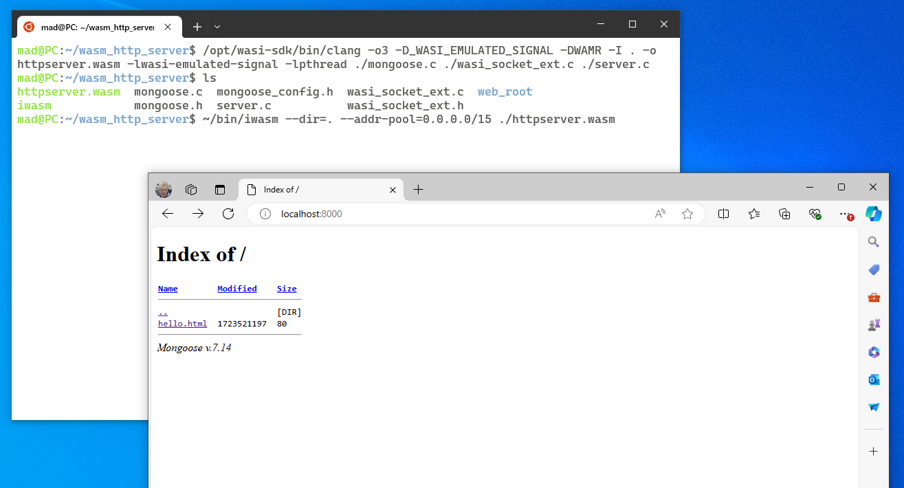

# A Web Server in WebAssembly with Mongoose and WAMR
Mongoose is an embedded Webserver, MQTT, WebSocket, SNTP server and a whole lot more. You can find out more about Mongoose on the Mongoose GitHub Repository - [cesanta/mongoose: Embedded Web Server (github.com)](https://github.com/cesanta/mongoose)

[WAMR is the Wasm Micro Runtime](https://github.com/bytecodealliance/wasm-micro-runtime), it is a WebAssembly runtime designed to run on IoT and embedded devices. Running a WebServer in a WebAssembly sandbox allows us to:

1. Provide some additional security, if the server is compromised the sandbox should limit the blast radius.
2. Provide portable code; writing the same web interface for multiple devices can be a pain, this web server should be portable between devices.
3. Run the webserver for a device on a development machine or other bit of hardware - super handy for debugging and development.

# A Step by Step Guide to Building a Webserver for WAMR 

There are a few gotcha's when building network enabled applications for WAMR and for building Mongoose for use on WAMR. This repository will go through the basics of getting these two great open source projects working together.

This repository will show you how to build the sample [Mongoose HTTP server example](https://github.com/cesanta/mongoose/tree/master/examples/http-server) and get it running as an wasm application for WAMR.  - If all goes well, then at the end of this readme, you should have a working HTTP server running in a portable `.wasm` file.

## Step 1 : Get WAMR and WASI SDK Installed

There is a step by step guide on how to get up and running with WAMR and the WASI SDK on [my personal blog](https://withbighair.com/webassembly/2024/01/25/Embedded-WASM-Development-Environment.html). But, to save you time, here's the highlights, assuming we're using Ubuntu, or Ubuntu for WSL (Windows Subsystem for Linux):

* Install the necessary build packages using `apt-get`:
  ```bash
  sudo apt-get install build-essential clang cmake ninja-build wget curl git
  ```

* Install WASI SDK; we'll download the tar file extract it and place it in the `/opt` directory:
  ```bash
  cd ~
  wget https://github.com/WebAssembly/wasi-sdk/releases/download/wasi-sdk-21/wasi-sdk-21.0-linux.tar.gz
  tar -xf wasi-sdk-21.0-linux.tar.gz
  sudo mkdir /opt/wasi-sdk
  sudo mv ./wasi-sdk-21.0/* /opt/wasi-sdk/
  ```

* Clone and build the WAMR Repository:
  ```bash
  git clone https://github.com/bytecodealliance/wasm-micro-runtime.git
  cd wasm-micro-runtime
  mdkir build
  cd build
  cmake ..
  make
  ```

  

## Step 2 : Build WAMR's Socket Example Applications

The `iwasm` runtime for WAMR doesn't typically include thread or socket handling support. Instead you need to build `iwasm` with both sockets and pthreads enabled. Doing this is rather straight forward as the WAMR project already includes a set of socket sample applications, and a cmake file which will rebuild `iwasm` with all the additional functionality we need.  You can find the example applications and the cmake file we need here - [Socket API Sample](https://github.com/bytecodealliance/wasm-micro-runtime/tree/main/samples/socket-api). Simply follow the build instructions and you will end up with a socket enabled `iwasm` runtime. But, to save you time, here's the highlights:

* Find the folder with the socket handling example could in it, and use cmake to build an updated `iwasm` along with all the example applications:
  ```bash
  cd ~/wasm-micro-runtime/samples/socket-api/
  mkdir build
  cd build
  cmake ..
  make
  ```
  
* Copy the build `iwasm` command line tool, and place it somewhere handy for future reference:
  ```bash
  mkdir ~/bin
  cp ./iwasm ~/bin/iwasm
  ```

  

## Step 3 : Clone the Mongoose Repository

Let's just clone the Mongoose repository:

```bash
cd ~
git clone https://github.com/cesanta/mongoose.git
```


## Step 4 : Clone This Repository

You'll need a customized `mongoose_custom.h` which is part of this repository.

```bash
cd ~
git clone https://github.com/woodsmc/wamr_with_mongoose.git
```


## Step 4 : Collect all the Necessary Parts

In order to build a working example http server we're going to need to collect all the necessary parts together from the three projects we've cloned so far. 

* Let's do this and create a new working directory with our http server code:

  ```bash
  cd ~
  mkdir wasm_http_server
  cd wasm_http_server
  ```
  
* Now let's copy in our custom header:
  ```bash
  cp ~/wamr_with_mongoose/mongoose_custom.h .
  ```

* The socket library files from WAMR:
  ```bash
  cp ~/wasm-micro-runtime/core/iwasm/libraries/lib-socket/src/wasi/wasi_socket_ext.c .
  cp ~/wasm-micro-runtime/core/iwasm/libraries/lib-socket/inc/wasi_socket_ext.h .
  ```
  
* The Mongoose framework:
  ```bash
  cp ~/mongoose/mongoose.h .
  cp ~/mongoose/mongoose.c .
  ```
## Creating  `server.c`  
The Mongoose project used to include an example http server in their repository, however a recent update has removed this. Instead the Mongoose project includes an example HTTP server as a code snippet in their [`readme.md` file](https://github.com/cesanta/mongoose). This is reproduce below for your reference:

```c
 #include "mongoose.h"   // To build, run: cc main.c mongoose.c

// HTTP server event handler function
void ev_handler(struct mg_connection *c, int ev, void *ev_data) {
  if (ev == MG_EV_HTTP_MSG) {
    struct mg_http_message *hm = (struct mg_http_message *) ev_data;
    struct mg_http_serve_opts opts = { .root_dir = "./web_root/" };
    mg_http_serve_dir(c, hm, &opts);
  }
}

int main(void) {
  struct mg_mgr mgr;  // Declare event manager
  mg_mgr_init(&mgr);  // Initialise event manager
  mg_http_listen(&mgr, "http://0.0.0.0:8000", ev_handler, NULL);  // Setup listener
  for (;;) {          // Run an infinite event loop
    mg_mgr_poll(&mgr, 1000);
  }
  return 0;
}
```

## Building The Server
Now that everything is ready, we need to build the http server this can be done with the following command:

```bash
/opt/wasi-sdk/bin/clang -o3 -I . -o httpserver.wasm ./mongoose.c ./wasi_socket_ext.c ./server.c
```

This should produce a `httpserver.wasm` file in your local directory. 

### Creating Content

As you can see from the code above the example webserver needs a `web_root` directory which some content to serve. Therefore we need to do the following steps:

* Create the `web_root` folder with:
  ```bash
  mkdir web_root
  ```

* Create an example file, called `example.html` which contains the following:
  ```html
  <html>
    <head></head>
    <body>
      <h1>Hello</h1>
      <p>World</p>
    </body>
  </html>
  ```

  

# Executing WAMR 
When you execute WAMR you have to tell it at the command line what permissions you will grant the running WebAssembly code. For the example WebServer to work you will need to provide the following command line switches:

* `--dir=.` this tells WAMR to allow the running WASM code to see the current directory. **NB:** The Server actually provides a listing of the content of the `web_root` subdirectory.
* `--addr-pool=0.0.0.0/15` tells WAMR to allow the running WASM code to use the IP address for local host

```
~/bin/iwasm --dir=. --addr-pool=0.0.0.0/15 httpserver.wasm 
```

This should give you a working webserver available on localhost at port 8000.


